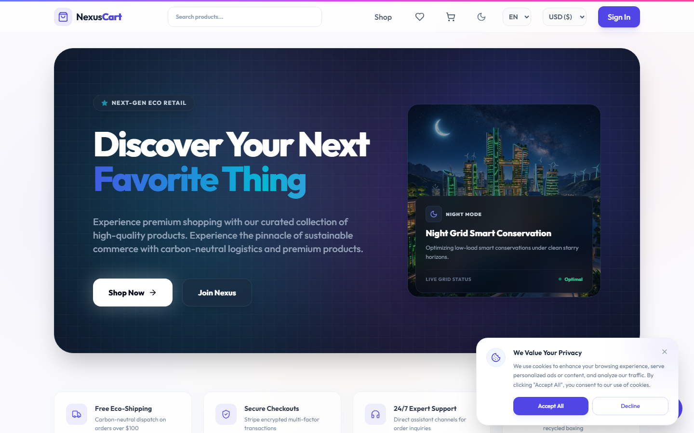
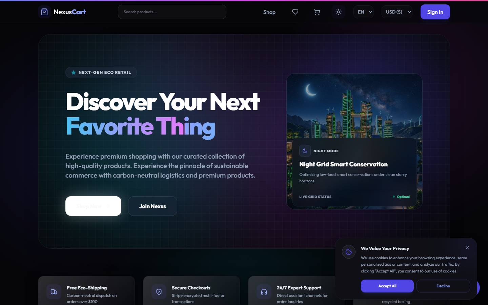
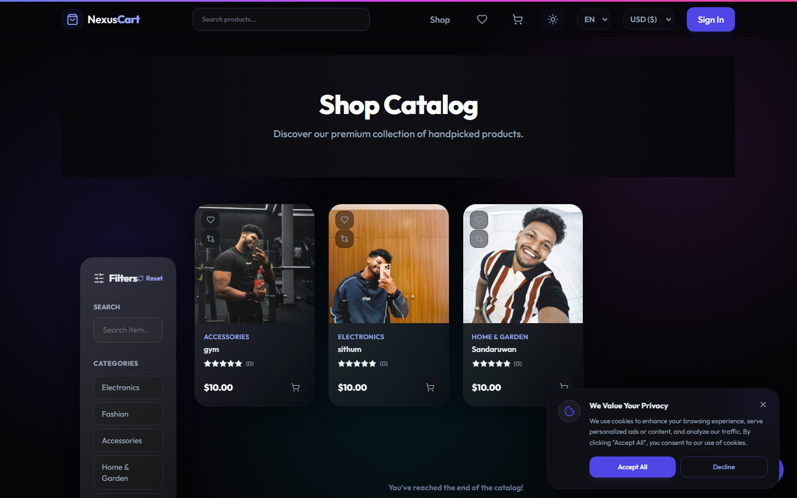
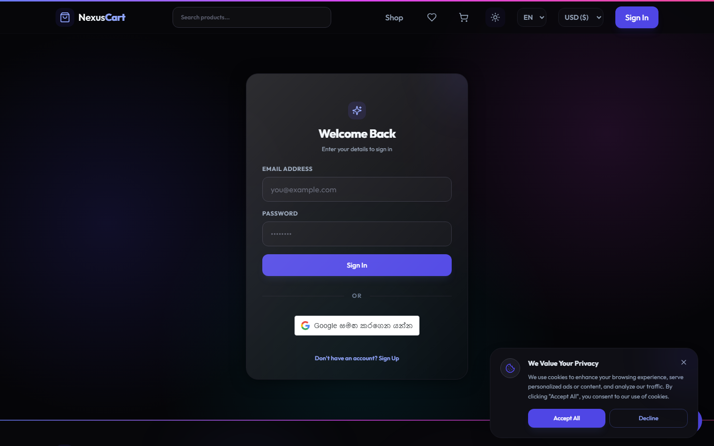
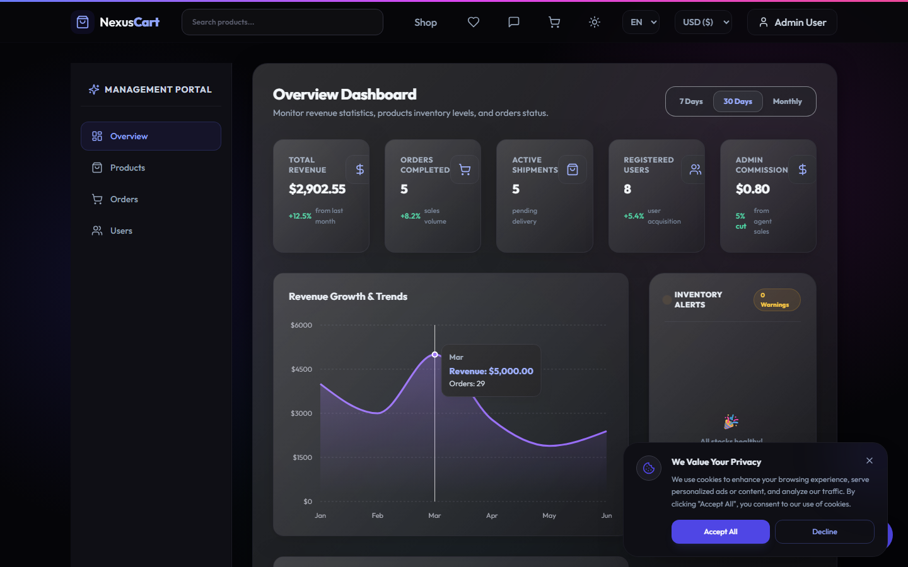
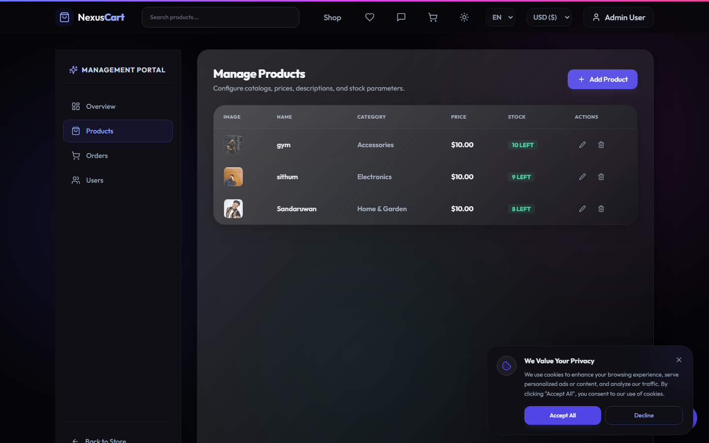

# 🌱 NexusCart - Eco-Friendly E-Commerce Platform

NexusCart is a modern, fully-featured **MERN Stack** (MongoDB, Express, React, Node.js) e-commerce web application. Designed with a vibrant, premium **Glassmorphism** aesthetic, NexusCart provides a top-tier shopping experience with advanced features like a Gamified Loyalty System, multi-vendor agent tracking, and an integrated AI Support Assistant.

---

## 📸 Screen Previews

<table width="100%">
  <tr>
    <td width="50%" align="center">
      <b>Home Page (Light Mode)</b><br/>
      
    </td>
    <td width="50%" align="center">
      <b>Home Page (Dark Mode)</b><br/>
      
    </td>
  </tr>
  <tr>
    <td width="50%" align="center">
      <b>Shop / Product Catalog</b><br/>
      
    </td>
    <td width="50%" align="center">
      <b>Login / Register</b><br/>
      
    </td>
  </tr>
  <tr>
    <td width="50%" align="center">
      <b>Admin Dashboard Analytics</b><br/>
      
    </td>
    <td width="50%" align="center">
      <b>Admin Product Management</b><br/>
      
    </td>
  </tr>
</table>

---

## ✨ Key Features

### 🎮 Gamified Loyalty System (Eco-Points)
- **Earn Points**: Customers earn "Eco-Points" for making purchases, leaving product reviews, and subscribing to the newsletter.
- **Tiered Progression**: Users unlock visually distinct tiers (`Bronze` -> `Silver` -> `Gold`) based on their points.
- **Redeem Discounts**: Points can be seamlessly redeemed at checkout for instant discounts.

### 💼 Agent / Multi-Vendor System
- Dedicated roles for **Agents** who can list their own products.
- Agents earn an automated **5% commission** on every sale.
- Custom Agent Dashboard with sales analytics and commission tracking.

### 💳 Secure Payments & Checkout
- Full **Stripe** integration for secure, reliable credit card processing.
- Coupon and Promo Code support.
- Automated **PDF Invoice** generation upon checkout.

### 🔐 Authentication & Security
- Standard Email/Password login via **JWT** (JSON Web Tokens).
- One-click **Google OAuth** login integration.
- Robust Role-Based Access Control (Admin, Agent, Customer).

### 🎨 Premium UI/UX
- Stunning **Glassmorphism** design utilizing **Tailwind CSS**.
- Micro-interactions, dynamic hover effects, and smooth route transitions via `framer-motion`.
- Dark Mode / Light Mode support.

### 🤖 AI Support & Real-Time Features
- Embedded **AI Chatbot** for 24/7 automated customer support.
- Real-time order status notifications using **Socket.io**.
- Automated Order Confirmation and Newsletter emails via **Nodemailer**.

### 🌍 Localization
- Full Internationalization (`i18next`) with support for **English** and **Sinhala**.

---

## 🛠️ Technology Stack

**Frontend:**
- React (Vite)
- Tailwind CSS
- Framer Motion
- React Router DOM
- Socket.io Client
- i18next

**Backend:**
- Node.js & Express
- MongoDB & Mongoose
- Stripe Node SDK
- Google Auth Library
- Nodemailer
- Socket.io Server

---

## 🚀 Getting Started

Follow these steps to run the project locally on your machine.

### 1. Clone the Repository
```bash
git clone https://github.com/sithumcha/Ecommerce_Web.git
cd Ecommerce_Web
```

### 2. Install Dependencies
You need to install dependencies for both the frontend and the backend.
```bash
# Install backend dependencies
cd backend
npm install

# Install frontend dependencies
cd ../frontend
npm install
```

### 3. Environment Variables (`.env`)
You must create `.env` files in both the `backend` and `frontend` folders.

**`backend/.env`**
```env
PORT=5001
MONGO_URI=your_mongodb_connection_string
JWT_SECRET=your_jwt_secret
STRIPE_SECRET=your_stripe_secret_key
GOOGLE_CLIENT_ID=your_google_oauth_client_id
GOOGLE_CLIENT_SECRET=your_google_oauth_secret
EMAIL_USER=your_email@gmail.com
EMAIL_PASS=your_app_password
```

**`frontend/.env`**
```env
VITE_API_URL=http://localhost:5001
VITE_STRIPE_PUBLIC_KEY=your_stripe_public_key
VITE_GOOGLE_CLIENT_ID=your_google_oauth_client_id
```

### 4. Run the Application

Start both servers concurrently from their respective directories:

**Run the Backend:**
```bash
cd backend
npm run dev
```

**Run the Frontend:**
```bash
cd frontend
npm run dev
```

The frontend will run on `http://localhost:5175` and the backend on `http://localhost:5001`.

---

## 👨‍💻 Developer
Developed by **[Sithum]**.